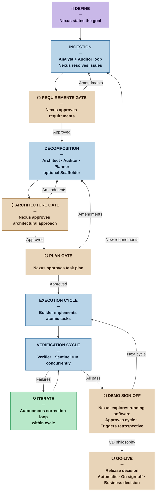

<!--
Copyright 2026 Pablo Ochendrowitsch

Licensed under the Apache License, Version 2.0 (the "License");
you may not use this file except in compliance with the License.
You may obtain a copy of the License at

    http://www.apache.org/licenses/LICENSE-2.0

Unless required by applicable law or agreed to in writing, software
distributed under the License is distributed on an "AS IS" BASIS,
WITHOUT WARRANTIES OR CONDITIONS OF ANY KIND, either express or implied.
See the License for the specific language governing permissions and
limitations under the License.
-->

# Rationale — Nexus SDLC

*Why an Agentic Software Development Lifecycle, and how to design one.*

---

## 1. The Problem with Current SDLC

Software development is fundamentally a knowledge work process: it transforms intent into executable systems through a series of cognitive operations — analysis, design, implementation, verification, and integration. Each step is expensive in human attention, error-prone at the boundaries between roles, and bottlenecked by sequential handoffs.

Despite five decades of methodological evolution — from Waterfall to Agile, from RUP to DevOps — the core constraint has remained constant: **human cognitive bandwidth**. Teams adopt sprints, standups, and CI pipelines not because the ceremonies are intrinsically valuable, but because they are coordination mechanisms for human limitations: limited memory, limited parallelism, limited tolerance for context-switching.

Large Language Models with tool use eliminate or dramatically relax several of these constraints. An agent does not lose context between days. It does not tire, skip documentation, or avoid the hard refactor. It can run tests, read stack traces, search codebases, and re-implement in seconds. This is not merely an acceleration — it is a structural change in what a development process can look like.

The question is not *whether* to integrate autonomous agents into the SDLC. It is **how to do so without sacrificing the qualities that make software trustworthy**: correctness, security, maintainability, and alignment with actual human intent.

---

## 2. Why Existing Approaches Fall Short

### 2.1 Code Assistants (Copilot, Cursor)
These tools operate at the token level — autocompleting within a file or function. They do not understand the lifecycle. They have no memory of the requirement that originated the task, no awareness of the test that validates it, no stake in the deployment that ships it. They are powerful but **contextually amnesiac**.

### 2.2 Fully Autonomous Systems (Devin, early AutoDev)
Research and commercial systems that remove the human from the loop entirely conflate two distinct problems: *can an agent produce working code?* and *is the working code what was actually wanted?* The alignment gap between a stated specification and true intent is not a technical problem LLMs solve — it is a communication problem that requires human judgment at key inflection points.

Additionally, fully autonomous systems have an unbounded **blast radius**: an agent with shell access and no approval gates can overwrite files, alter schemas, push to production branches, and consume external APIs without any checkpoint to catch misaligned behavior.

### 2.3 Academic Multi-Agent SDLC (ChatDev, MetaGPT)
These systems demonstrated that role-playing agents (PM, Architect, Engineer, QA) can complete software tasks end-to-end. They are significant proofs of concept. However, they were designed for research benchmarks — constrained, well-specified tasks — not for production software with evolving requirements, legacy constraints, and organizational context. They also lack persistent state, audit trails, and explicit human gates.

---

## 3. The Core Insight: Managed Autonomy

The design principle of Nexus SDLC is that **autonomy and human control are not opposites on a spectrum — they operate on different axes**.

An agent can be highly autonomous within a bounded, well-defined task while simultaneously being tightly controlled at the level of *which tasks are authorized to run*. The human does not need to supervise every line of code. The human needs to:

1. Approve the requirements as understood before architectural work begins
2. Approve the architectural approach before planning begins
3. Approve the task plan before execution begins
4. Validate what was built — through running software, not document review — before the next cycle begins
5. Decide when to release, and against which version

Between those points, the swarm reasons, fails, retries, and converges — autonomously. This is the **Human-in-the-Middle** model: not human-out-of-the-loop (dangerous), not human-at-every-step (eliminates the value of agents), but human at the **right** steps.

This maps directly to well-established SDLC wisdom:
- Cockburn's *cooperative game* — software development is fundamentally a human coordination activity even when agents do the mechanical work
- Snowden's *Cynefin* — complex domains require human sense-making at decision points, not just at the start
- Goldratt's *Theory of Constraints* — identify the true bottleneck; in agentic systems it is human attention, not execution speed

---

## 4. Design Goals

### 4.1 Verifiable Intent
Every task executed by the swarm must be traceable to a human-approved requirement. Agents must not infer intent beyond what was stated and approved. The gap between *stated spec* and *true intent* is bridged through structured elicitation — an Analyst produces the Brief and Requirements List, an Auditor validates them in a loop with the Nexus, and the Nexus approves at the Requirements Gate before decomposition begins.

**Design implication:** The ingestion phase is a multi-pass Analyst/Auditor/Nexus loop, not a one-shot handoff. Requirements are traceable to the Brief. Tasks are traceable to requirements. The Auditor enforces this traceability — a requirement with no origin is flagged `[UNTRACED]` and is not approved.

### 4.2 Bounded Blast Radius
No agent action that affects shared or irreversible state — deploying to production, calling external APIs, creating database migrations — may proceed without prior authorization. Agents operate within declared tool access tiers; high-risk operations require explicit Nexus approval.

**Design implication:** A five-tier access model (Read and Reason → Scoped Write → Command Execution → Restricted → Human-Gated) is declared in each agent's definition file. Enforcement is behavioral — strong prompt instructions, human capability gating, and output review before changes are applied.

### 4.3 Self-Correcting Feedback Loops
The swarm must be able to iterate on failures without human intervention, up to a defined threshold. Test failures, lint errors, and type errors are inputs to the next Builder cycle — not escalations to the human. Escalation occurs only when the swarm cannot converge within its authorized scope.

**Design implication:** The Orchestrator manages the iterate loop, enforcing a max_iterations bound declared in the Methodology Manifest. A convergence signal (non-decreasing failure count across consecutive iterations) triggers early escalation when thrashing is detected. All routing — including failure feedback to the Builder — passes through the Orchestrator, which maintains complete project state throughout.

### 4.4 Auditable Reasoning
Every agent decision — architectural choice, implementation approach, test strategy — must be traceable. This serves two purposes: it allows post-hoc review by the Nexus, and it provides the artifact trail that future agent invocations load as context.

**Design implication:** Every agent writes its output to a declared, conventional location in the project repository. The Orchestrator maintains an escalation log. ADRs record architectural decisions with rationale, consequences, and fitness functions. The artifact trail is the audit record — it is git-versioned and survives the project's lifetime.

### 4.5 Graceful Degradation
When agents fail to converge, the system must fail safely and informatively — surfacing a clear escalation to the Nexus with the failure context, attempted approaches, and a specific question. The Nexus is never handed a silent failure or an opaque error.

**Design implication:** Escalation paths are first-class citizens of the orchestration design. Every failure mode has a defined response and a defined route. Production incidents have two defined tracks (next-cycle or hotfix). Escalation patterns — three or more occurrences of the same failure mode — trigger a Methodologist review of the process configuration itself.

### 4.6 Process Calibration
A framework that demands the same rigor for a personal script as for a regulated financial system is overengineered for the former and reckless for the latter. The swarm must right-size itself to the project's stakes and scale.

**Design implication:** A four-profile system (Casual / Commercial / Critical / Vital) classifies projects by the consequence of failure. Paired artifact weights (Sketch / Draft / Blueprint / Spec) calibrate documentation rigor. The Methodologist agent produces a Methodology Manifest that configures the swarm for the specific project — activating the appropriate agents, setting artifact weight requirements, and declaring which gates are in force. The Manifest is re-evaluated at every Demo Sign-off; the swarm can graduate across profiles as the project grows.

### 4.7 Iterative Approximation
Requirements are never complete on first statement. Architecture is never final at first proposal. Plans are revised by implementation reality. The swarm must be designed to make forward progress on partial, approximate input and refine iteratively — never blocking on perfect information.

**Design implication:** Agents assume-and-flag rather than ask-and-wait. Working assumptions are visible in every artifact — `[ASSUMPTION]`, `[DEFERRED]`, `[FLAGGED]` markers make uncertainty explicit so the Nexus can override it. Escalations carry one specific question, not a decision matrix. First answers are understood to be approximations. This principle is not advisory — it is embedded in every agent's behavioral instructions.

---

## 5. Process Design

### 5.1 Lifecycle

| Phase | Actor(s) | Output |
|---|---|---|
| **Define** | Nexus (Human) | Goal, constraints, acceptance criteria |
| **Ingestion** | Analyst, Auditor, Nexus (loop) | Brief, Requirements List |
| **Requirements Gate** | Nexus (Human) | Approved requirements |
| **Decomposition** | Architect, Auditor, Planner, Scaffolder (optional) | Architecture artifacts, Task Plan, optional scaffold |
| **Architecture Gate** | Nexus (Human) | Approved architectural approach |
| **Plan Gate** | Nexus (Human) | Approved task plan |
| **Execution Cycle** | Builder (one task at a time) | Implementation artifacts, handoff notes |
| **Verification Cycle** | Verifier + Sentinel (concurrent) | Verification Reports, Demo Scripts, Security Report |
| **Iterate** | Builder + Verifier (autonomous) | Corrected artifacts |
| **Demo Sign-off** | Nexus (Human) | Signed-off cycle, next cycle authorized |
| **Go-Live** | DevOps, Scribe | Production deployment, release documentation |

### 5.2 Agent Role Taxonomy

Agents are specialized by concern, not by seniority. Each has a defined input contract, output contract, and tool access tier. The full roster:

**Configuration plane**
- **Methodologist** — assesses the project, produces the Methodology Manifest, acts as the process conscience throughout. Re-activates at every Demo Sign-off.

**Control plane**
- **Orchestrator** — the communication hub. Owns global state, routes all work, manages gate briefings, maintains the escalation log. Never produces implementation artifacts.

**Analysis and planning plane**
- **Analyst** — elicits requirements, produces the Brief (domain model, vocabulary, delivery channel) and the Requirements List.
- **Auditor** — validates work for correctness. Two modes: requirements audit (CONTRADICTION, GAP, AMBIGUOUS, UNTRACED, REGRESSION, DEFERRED) and architectural audit (UNCOVERED, INCONSISTENCY, UNGROUNDED, INADEQUATE).
- **Architect** — technology selection, component boundaries, ADRs, fitness functions, schema strategy, spike identification and execution.

**Design and structure plane (optional)**
- **Designer** — UX/IxD for projects with a delivery channel that requires interface design.
- **Scaffolder** — translates the Architect's component decisions into code structure before Builder work begins. Invoked when the profile is not Casual and the iteration contains three or more Builder tasks.

**Execution plane**
- **Builder** — implements atomic tasks. Strict TDD. Has a direct path to the Architect for implementation-time architectural questions — the only agent-to-agent communication that does not route through the Orchestrator.

**Verification and security plane**
- **Verifier** — test-first verification across four layers: integration, system, acceptance, and performance. Produces Verification Reports and Demo Scripts.
- **Sentinel** — security audit every cycle: dependency review (APPROVE / CONDITIONAL / REJECT) and live OWASP testing against staging. Critical or High findings block Demo Sign-off.

**Delivery plane**
- **DevOps** — CI/CD pipeline, environment provisioning, deployment. Implements the CD philosophy declared in the Manifest.
- **Scribe** — documentation transformation at release time. Channel-aware output (library → reference docs, API → Swagger/OpenAPI, app → user manual). Always produces release notes and changelog.

### 5.3 Artifact Trail and State

Project state is maintained as an **artifact trail** — a collection of markdown files written by agents to conventional locations in the project repository. No single document travels through the lifecycle; each agent writes its output to a declared location and loads only the artifacts relevant to its work.

The **Methodology Manifest** is the swarm's configuration document. It declares the active profile and artifact weight, the active agents, documentation requirements per agent, and the human gate configuration. The Orchestrator reads the current Manifest at every invocation. Manifests are versioned — the full version history is the project's process audit trail.

All artifacts are human-readable markdown. The framework has no software runtime, no serialization layer, and no infrastructure dependency. The project repository and git history are the only persistence required.

### 5.4 CD Philosophy

The release model is not prescribed — it is declared in the Methodology Manifest and implemented by DevOps:

| Model | Go-Live trigger |
|---|---|
| **Continuous Deployment** | Automatically on CI green — no human gate at release |
| **Continuous Delivery** | At Demo Sign-off — features approved, deployment follows |
| **Cycle-based** | Nexus business decision — any previously signed-off version, at any time |

The Cycle-based model reflects a reality that Agile frameworks often obscure: the decision to release is sometimes organizational, regulatory, or market-driven, not technical. A Nexus may approve features every two weeks and choose to release to production quarterly. The framework treats this as a first-class design choice, not an edge case.

### 5.5 Fitness Functions and Observability

Architectural characteristics (the -ilities: performance, reliability, security, scalability) are specified as **dual-use fitness functions** that serve two purposes simultaneously:

- **Development verification:** a test or check run during the CI/build phase that confirms the characteristic holds
- **Production observability:** the metric to collect when the system is live, with explicit warning and critical thresholds and alarm interpretations

This means the architecture definition and the observability specification are the same artifact. An ADR that defines "p95 response time < 200ms" also defines the production monitoring threshold that will alert the operator when the architecture is degrading. The Architect writes both sides; the Verifier implements the dev check; the Builder implements the monitoring instrumentation.

---

## 6. Relationship to Prior Art

| System / Method | What Nexus Inherits | What Nexus Rejects or Extends |
|---|---|---|
| **Crystal** (Cockburn) | Project criticality classification; human-centric communication; cognitive load reduction as a design goal | C0-C3 codes (replaced by plain-language profiles: Casual/Commercial/Critical/Vital) |
| **Scrum** | Empirical process control; transparent inspection at cycle boundaries; retrospective at every iteration | Sprint ceremony overhead; assumption of human executors |
| **XP** | TDD as the verification loop; simple design; fast feedback; system metaphor for Casual-profile architecture | Human-centric pair model; feedback loops that bypass the Orchestrator |
| **Shape Up** (Basecamp) | Appetite over estimate; the human provides direction and boundaries, agents fill in details; no perfect specs required | Six-week fixed scope (replaced by profile-calibrated cycles) |
| **Lean** | Eliminate waste in manual repetition; value stream thinking; last responsible moment for decisions | Push-based batch work |
| **DDD** | Ubiquitous language shared between human and agent layers; domain model as the vocabulary of the codebase | Big design upfront |
| **RUP** | Architecture-centric decomposition; risk-first prioritization; milestone quality gates | Documentation overhead for lower-stakes projects |
| **MetaGPT** | Role taxonomy; SOP-driven agent behavior; structured inter-agent communication | No human checkpoints; no persistent state |
| **ChatDev** | Multi-agent conversation for SDLC tasks | Research-only scope; no production safety model |
| **ReAct** | Reasoning + acting loop as base agent architecture | Single-agent; no orchestration |
| **Reflexion** | Self-correction via verbal reflection | Session-scoped memory only |
| **Continuous Delivery** (Humble/Farley) | Automated pipeline; always-releasable main branch; deployment as a business decision | One-size-fits-all release model (replaced by three explicit CD philosophy models) |
| **Accelerate** (Forsgren et al.) | DORA metrics as fitness functions for delivery pipeline health | |

---

## 7. Open Problems

These questions do not have settled answers in the current design and will require empirical iteration:

1. **Context window management** — Long-running projects accumulate a large artifact trail. What is the right retrieval and summarization strategy for agents loading context from a mature project? The conventional file locations partially address this (each agent loads only what it needs), but the right boundaries remain empirically unsettled.

2. **Trust calibration** — How does the Nexus develop appropriate trust in agent output over time? The Demo Sign-off gate — where the Nexus explores running software rather than reviewing documents — is designed to build trust on evidence. Whether confidence develops appropriately in practice is an open empirical question.

3. **Evaluation validity** — SWE-bench measures task completion on isolated issues. Nexus SDLC spans the full lifecycle: requirements quality, architectural coherence, verification coverage, security posture, and Nexus cognitive load. How do we measure the framework's quality at each of these dimensions? DORA metrics capture delivery performance; no equivalent benchmark yet exists for plan quality or requirement alignment.

4. **Profile boundary judgment** — The Methodologist must classify projects as Casual, Commercial, Critical, or Vital. The boundary cases (a Commercial project becoming Critical as it gains users; a Vital prototype) require judgment the current Manifest format does not fully encode. Better elicitation heuristics for profile assessment remain to be developed.

5. **Multi-project coordination** — When the same Nexus runs multiple concurrent projects, does the artifact trail model scale? Can the Methodologist and Orchestrator be shared across projects without cross-contamination?

---

## 8. Summary

Nexus SDLC is a response to a specific moment: LLMs have crossed the capability threshold where autonomous software agents are feasible across the full development lifecycle, but the field lacks a production-grade framework for deploying them safely.

The framework's core bet is that the right answer is not maximum autonomy, but **calibrated autonomy** — agents that are deeply capable within their scope, and a human freed from mechanical execution to focus exclusively on intent, judgment, and validation.

The design is complete as a set of agent definition files. Thirteen specialized agents cover the full lifecycle — from requirements elicitation through architectural design, implementation, verification, security audit, and release. Each agent has a declared role, input contract, output contract, tool access tier, and behavioral constraints. The Methodology Manifest configures the swarm for the specific project. The artifact trail provides the audit record. Human gates ensure the Nexus approves what matters — and only what matters.

What remains is empirical validation: deploying the framework against real projects, measuring where it performs and where it does not, and iterating the agent definitions based on evidence. The prior art in both SDLC methodology and agentic AI research provides the theoretical foundation. The engineering is done. The field testing begins now.

---

*See [REFERENCES.md](REFERENCES.md) for the full bibliographic foundation.*
