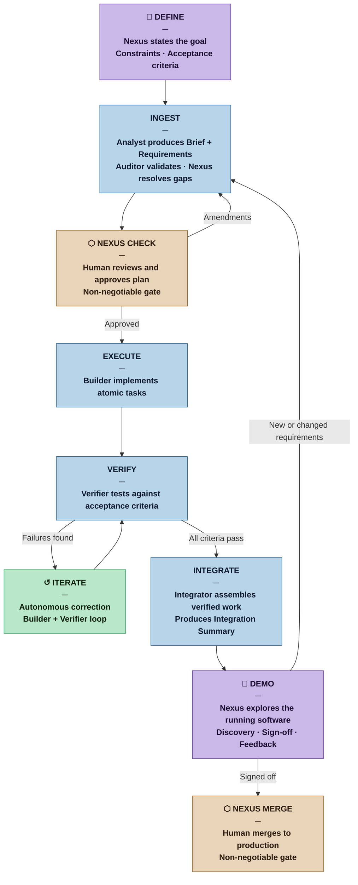

# Rationale — Nexus SDLC

*Why an Agentic Software Development Lifecycle, and how to design one.*

---

## 1. The Problem with Current SDLC

Software development is fundamentally a knowledge work process: it transforms intent into executable systems through a series of cognitive operations — analysis, design, implementation, verification, and integration. Each step is expensive in human attention, error-prone at the boundaries between roles, and bottlenecked by sequential handoffs.

Despite five decades of methodological evolution — from Waterfall to Agile, from RUP to DevOps — the core constraint has remained constant: **human cognitive bandwidth**. Teams adopt sprints, standups, and CI pipelines not because the ceremonies are intrinsically valuable, but because they are coordination mechanisms for human limitations: limited memory, limited parallelism, limited tolerance for context-switching.

Large Language Models (LLMs) with tool use eliminate or dramatically relax several of these constraints. An agent does not lose context between days. It does not tire, skip documentation, or avoid the hard refactor. It can run tests, read stack traces, search codebases, and re-implement in seconds. This is not merely an acceleration — it is a structural change in what a development process can look like.

The question is not *whether* to integrate autonomous agents into the SDLC. It is **how to do so without sacrificing the qualities that make software trustworthy**: correctness, security, maintainability, and alignment with actual human intent.

---

## 2. Why Existing Approaches Fall Short

### 2.1 Code Assistants (Copilot, Cursor)
These tools operate at the token level — autocompleting within a file or function. They do not understand the lifecycle. They have no memory of the requirement that originated the task, no awareness of the test that validates it, no stake in the deployment that ships it. They are powerful but **contextually amnesiac**.

### 2.2 Fully Autonomous Systems (Devin, early AutoDev)
Research and commercial systems that remove the human from the loop entirely conflate two distinct problems: *can an agent produce working code?* and *is the working code what was actually wanted?* The alignment gap between a stated specification and true intent is not a technical problem LLMs solve — it is a communication problem that requires human judgment at key inflection points.

Additionally, fully autonomous systems have an unbounded **blast radius**: an agent with shell access and no approval gates can overwrite files, alter schemas, push to production branches, and consume external APIs without any checkpoint to catch misaligned behavior.

### 2.3 Academic Multi-Agent SDLC (ChatDev, MetaGPT)
These systems demonstrated that role-playing agents (PM, Architect, Engineer, QA) can complete software tasks end-to-end. They are significant proofs of concept. However, they were designed for research benchmarks — constrained, well-specified tasks — not for production software with evolving requirements, legacy constraints, and organizational context. They also lack persistent state, audit trails, and explicit human gates.

---

## 3. The Core Insight: Managed Autonomy

The design principle of Nexus SDLC is that **autonomy and human control are not opposites on a spectrum — they operate on different axes**.

An agent can be highly autonomous within a bounded, well-defined task while simultaneously being tightly controlled at the level of *which tasks are authorized to run*. The human does not need to supervise every line of code. The human needs to:

1. Define the goal clearly enough that success is verifiable
2. Approve the plan before execution begins
3. Validate the output before it affects shared state

Between those three points, the swarm should be free to reason, fail, retry, and converge — autonomously. This is the **Human-in-the-Middle** model: not human-out-of-the-loop (dangerous), not human-at-every-step (eliminates the value of agents), but human at the **right** steps.

This maps directly to well-established SDLC wisdom:
- Cockburn's *cooperative game* — software development is fundamentally a human coordination activity even when agents do the mechanical work
- Snowden's *Cynefin* — complex domains require human sense-making at decision points, not just at the start
- Goldratt's *Theory of Constraints* — identify the true bottleneck; in agentic systems it is human attention, not execution speed

---

## 4. Design Goals

### 4.1 Verifiable Intent
Every task executed by the swarm must be traceable to a human-approved specification. Agents must not infer requirements beyond what was stated and approved. The gap between *stated spec* and *true intent* is bridged through structured elicitation at the Nexus Check, not through agent assumption.

**Design implication:** The decomposition phase produces an explicit, human-readable plan. Approval is mandatory before execution begins.

### 4.2 Bounded Blast Radius
No agent action that affects shared or irreversible state — committing to version control, calling external APIs, modifying databases, deploying infrastructure — may proceed without prior authorization. Agents operate in sandboxed, reversible environments by default.

**Design implication:** Agents have tiered tool access. High-risk operations require explicit Nexus approval. All agent actions are logged with tool call, inputs, outputs, and timestamp.

### 4.3 Self-Correcting Feedback Loops
The swarm must be able to iterate on failures without human intervention, up to a defined threshold. Test failures, lint errors, and type errors are inputs to the next agent cycle — not escalations to the human. Escalation occurs only when the swarm cannot converge within its authorized scope.

**Design implication:** Verification agents feed structured failure reports back into coding agents. Loop termination conditions (max iterations, confidence threshold) are configurable per task type.

### 4.4 Auditable Reasoning
Every agent decision — architectural choice, implementation approach, test strategy — must be logged with its reasoning. This serves two purposes: it allows post-hoc review by the Nexus, and it enables future agents to learn from prior decisions within the same project context.

**Design implication:** Agent outputs include a structured reasoning trace alongside the artifact. The orchestration layer maintains a persistent decision log per project.

### 4.5 Graceful Degradation
When agents fail to converge, the system must fail safely and informatively — surfacing a clear escalation to the Nexus with the failure context, attempted approaches, and a specific question. The human is never handed a silent failure or an opaque error.

**Design implication:** Escalation paths are first-class citizens of the orchestration design, not afterthoughts.

---

## 5. Process Design

### 5.1 Lifecycle Phases

| Phase | Actor | Output |
|---|---|---|
| **Define** | Human (Nexus) | High-level goal, constraints, acceptance criteria |
| **Decompose** | Orchestrator + Planner agents | Atomic task list, dependency graph, risk flags |
| **Nexus Check** | Human (Nexus) | Approved/amended plan |
| **Execute** | Coder agents | Implementation artifacts (code, config, migrations) |
| **Verify** | QA + Security + Lint agents | Test results, coverage report, vulnerability scan |
| **Iterate** | Coder + QA agents (autonomous) | Corrected artifacts |
| **Integrate** | Integration agent | Clean branch, passing CI, summarized diff |
| **Nexus Merge** | Human (Nexus) | Merged PR, deployment authorization |

### 5.2 Agent Role Taxonomy

Agents are specialized by concern, not by seniority. Each has a defined input contract, output contract, and tool access profile.

- **Orchestrator** — maintains global state, routes tasks, handles escalation. Never writes code.
- **Planner** — decomposes goals into atomic tasks with dependencies and risk annotations.
- **Coder** — implements. Has read/write access to the working branch only.
- **Reviewer** — static analysis, style, architecture consistency. Read-only.
- **QA** — generates and runs tests, interprets results, produces structured failure reports.
- **Security** — SAST, dependency auditing, secret detection. Read-only.
- **Integrator** — assembles artifacts into a coherent branch, resolves merge conflicts, produces the PR summary.

### 5.3 Context & State Management

A persistent **Project Context** object travels through the entire lifecycle. It contains:
- Original goal and constraints
- Approved plan and any Nexus amendments
- Decision log (all agent reasoning traces)
- Current working state (file diffs, test results, open failures)
- Escalation history

This context is the mechanism by which the swarm maintains coherence across agent handoffs and iteration cycles. No agent operates on a blank slate.

### 5.4 Evaluation Strategy

Nexus SDLC agents should be benchmarked against:
- **SWE-bench** — real GitHub issues, measures task completion and correctness
- **Internal regression suite** — project-specific tests that define acceptable behavior
- **DORA metrics** (Forsgren et al.) — deployment frequency, lead time, change failure rate, recovery time
- **Human satisfaction scores** — Nexus-rated quality of plans, PRs, and escalation clarity

---

## 6. Relationship to Prior Art

| System / Method | What Nexus Inherits | What Nexus Rejects |
|---|---|---|
| Scrum | Sprint cadence, explicit planning checkpoint, retrospective-style iteration | Ceremony overhead, assumption of human executors |
| XP | TDD as verification loop, pair programming → reviewer agent | Human-centric pair model |
| Lean | Eliminate waste (manual repetition), value stream thinking | Push-based batch work |
| DDD | Ubiquitous language between human and agent layers | Big design upfront |
| MetaGPT | Role taxonomy, SOP-driven agent behavior | No human checkpoints, no persistent state |
| ChatDev | Multi-agent conversation for SDLC tasks | Research-only scope, no production safety model |
| ReAct | Reasoning + acting loop as base agent architecture | Single-agent, no orchestration |
| Reflexion | Self-correction via verbal reflection | Session-scoped memory only |
| Continuous Delivery | Automated pipeline, always-releasable main branch | Manual promotion gates |

---

## 7. Open Problems

These are the design questions that do not yet have settled answers and will require empirical iteration:

1. **Specification grounding** — How much ambiguity in a human goal can the Planner agent resolve without asking? What is the right elicitation protocol for the Nexus Check?
2. **Loop termination** — When should the swarm escalate rather than retry? What signals indicate genuine convergence vs. test-gaming?
3. **Context window management** — Long-running projects will exceed any context limit. What is the right summarization and retrieval strategy for the Project Context?
4. **Trust calibration** — How does the Nexus develop appropriate trust in agent output over time? Can confidence signals be made legible and well-calibrated?
5. **Multi-project coordination** — Can the orchestration layer manage concurrent projects without cross-contamination of context?
6. **Evaluation validity** — SWE-bench measures task completion on isolated issues. How do we measure quality of the full lifecycle, including plan quality and human cognitive load reduction?

---

## 8. Summary

Nexus SDLC is a response to a specific historical moment: LLMs have crossed the capability threshold where autonomous software agents are feasible, but the field lacks a production-grade framework for deploying them safely across the full development lifecycle.

The framework's core bet is that the right answer is not maximum autonomy, but **calibrated autonomy** — agents that are deeply capable within their scope, and humans who are freed from mechanical execution to focus exclusively on intent, judgment, and validation.

The prior art in both SDLC methodology (Agile, Lean, XP, DDD) and agentic AI research (ReAct, MetaGPT, SWE-agent) provides the theoretical and empirical foundation. What remains is the engineering: building the orchestration layer, defining the agent contracts, establishing the evaluation harness, and iterating toward a system that a real team would trust with a real codebase.

That is what this project is for.

---

*See [REFERENCES.md](REFERENCES.md) for the full bibliographic foundation.*
