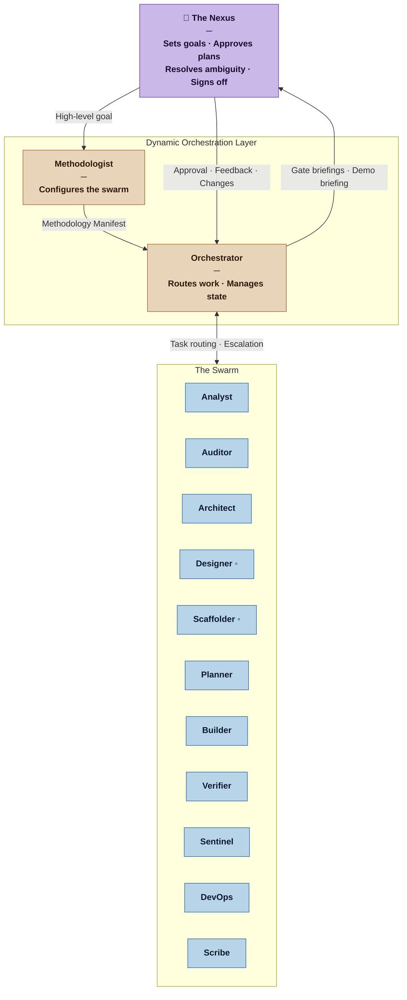
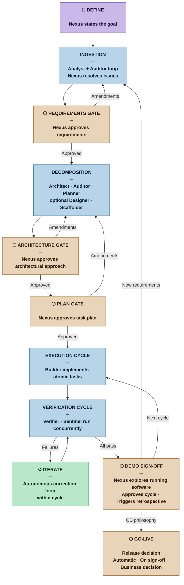

# Nexus SDLC

**Nexus SDLC** is a human-in-the-middle orchestration framework that coordinates a specialized swarm of autonomous agents to automate the end-to-end software development lifecycle.

---

## Abstract

**Nexus SDLC** transforms the traditional, manual Software Development Lifecycle into a dynamic, multi-agent collaboration. By placing a **Human-in-the-Middle (HITM)** at the architectural "Nexus," the system ensures that AI-driven velocity never diverges from human-defined quality, security, and architectural standards.

The framework operates as a synchronized collective of specialized agents that reason, execute, and self-correct. The human remains the central node of the process — providing high-level intent, resolving ambiguity, and validating critical pivots before code enters production.

---

## Core Architecture: Managed Autonomy

The framework is built on the principle of **Managed Autonomy**. Rather than a static set of tools, Nexus utilizes a modular agentic swarm where roles are defined by the specific needs of the project phase.

* **The Nexus (Human):** The strategic control center. Provides high-level goals, resolves logic paradoxes, and performs final validation.
* **The Swarm (Agents):** Specialized autonomous units capable of task decomposition, implementation, and rigorous validation.
* **Dynamic Orchestration:** A coordination layer that manages state, handles agent hand-offs, and maintains a unified context across the entire lifecycle.

*◦ optional — invoked when the project profile and delivery channel require it*

---

## How It Works

1. **Define** — The Nexus states the high-level goal and constraints.
2. **Ingestion** — Analyst elicits requirements; Auditor validates them in a loop with the Nexus resolving ambiguities. Output: the Brief and Requirements List. The Nexus approves at the **Requirements Gate**.
3. **Decomposition** — Architect produces the architectural approach; Auditor audits it; Planner decomposes into atomic tasks; Designer and Scaffolder are invoked when the project requires them. The Nexus approves at the **Architecture Gate** and **Plan Gate**.
4. **Execution Cycle** — Builder implements one task at a time under strict TDD.
5. **Verification Cycle** — Verifier tests against acceptance criteria and Sentinel runs security audits concurrently. Failures feed back into an autonomous iterate loop.
6. **Demo Sign-off** — The Nexus explores the running software. On approval, the cycle is signed off and the swarm is ready for the next cycle or release.
7. **Go-Live** — DevOps deploys to production; Scribe publishes documentation and release notes.

---

## Key Objectives

* **Reduced Cognitive Load:** Focus on *intent* and *validation* rather than syntax and repetitive boilerplate.
* **Autonomous Iteration:** Agents self-correct based on technical feedback loops without constant human prompting.
* **Traceable Reasoning:** Every decision made by the agentic collective is logged, providing a transparent audit trail of the development process.
* **Safety by Design:** Critical checkpoints ensure that AI agents cannot execute high-risk operations without Nexus approval.

---

## Documentation

| Document | Description |
|---|---|
| [RATIONALE.md](RATIONALE.md) | Design rationale — the why, the reasoning, and the process model behind an agentic SDLC |
| [REFERENCES.md](REFERENCES.md) | Full bibliographic reference library: SDLC methodologies, agentic AI research, and foundational theory |
| [process/INDEX.md](process/INDEX.md) | Architecture decisions (DEC) and open questions (OQ) — the living design record |
| [guidelines/diagram-guidelines.md](guidelines/diagram-guidelines.md) | Mermaid diagram standards for all agents that produce visual output |

## Agent Definitions

Loadable agent files in [`/agents/`](agents/):

| Agent | Plane | Role |
|---|---|---|
| [methodologist.md](agents/methodologist.md) | Configuration | Configures the swarm; runs retrospectives; versions the Methodology Manifest |
| [orchestrator.md](agents/orchestrator.md) | Control | Routes work; manages lifecycle state; prepares Nexus gate briefings |
| [analyst.md](agents/analyst.md) | Analysis & Planning | Produces the Brief and Requirements List |
| [auditor.md](agents/auditor.md) | Analysis & Planning | Validates requirements and architectural decisions; enforces traceability |
| [architect.md](agents/architect.md) | Analysis & Planning | Trade-off analysis, architectural characteristics, ADRs, fitness functions |
| [designer.md](agents/designer.md) | Design & Structure ◦ | UX/IxD for projects with a UI delivery channel |
| [scaffolder.md](agents/scaffolder.md) | Design & Structure ◦ | Translates component decisions into code structure before Builder work begins |
| [planner.md](agents/planner.md) | Analysis & Planning | Decomposes requirements into atomic tasks with acceptance criteria |
| [builder.md](agents/builder.md) | Execution | Implements one task at a time under strict TDD |
| [verifier.md](agents/verifier.md) | Verification & Security | Tests against acceptance criteria; produces Verification Reports and Demo Scripts |
| [sentinel.md](agents/sentinel.md) | Verification & Security | Dependency security audit and live OWASP testing against staging |
| [devops.md](agents/devops.md) | Delivery | CI/CD pipeline, environment provisioning, deployment |
| [scribe.md](agents/scribe.md) | Delivery | Documentation transformation at release time; produces release notes and changelog |

*◦ optional — invoked when the project profile and delivery channel require it*

---

## License

This project is licensed under the **Apache License 2.0**. See the [LICENSE](LICENSE) file for details.
