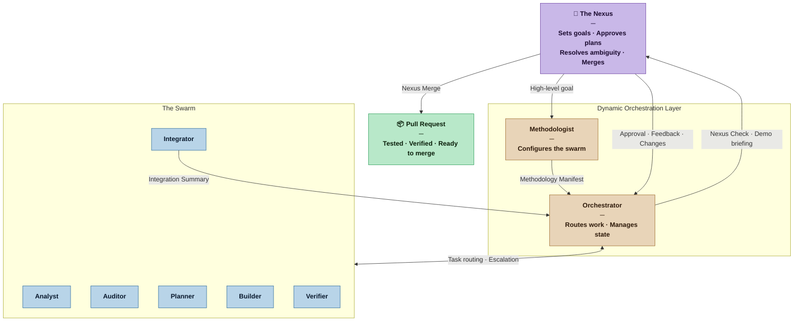
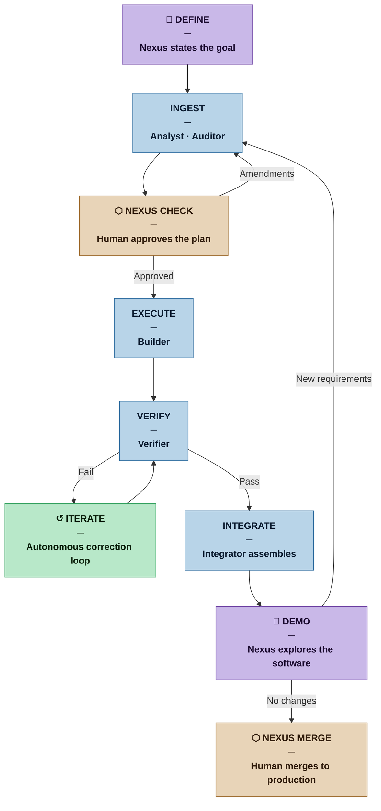

# Nexus SDLC

**Nexus SDLC** is a human-in-the-middle orchestration framework that coordinates a specialized swarm of autonomous agents to automate the end-to-end software development lifecycle.

---

## Abstract

**Nexus SDLC** transforms the traditional, manual Software Development Lifecycle into a dynamic, multi-agent collaboration. By placing a **Human-in-the-Middle (HITM)** at the architectural "Nexus," the system ensures that AI-driven velocity never diverges from human-defined quality, security, and architectural standards.

The framework operates as a synchronized collective of specialized agents that reason, execute, and self-correct. The human remains the central node of the process—providing high-level intent, resolving ambiguity, and validating critical pivots before code enters production.

---

## Core Architecture: Managed Autonomy

The framework is built on the principle of **Managed Autonomy**. Rather than a static set of tools, Nexus utilizes a modular agentic swarm where roles are defined by the specific needs of the project phase.

* **The Nexus (Human):** The strategic control center. Provides high-level goals, resolves logic paradoxes, and performs final validation.
* **The Swarm (Agents):** Specialized autonomous units capable of task decomposition, implementation, and rigorous validation.
* **Dynamic Orchestration:** A coordination layer that manages state, handles agent hand-offs, and maintains a unified context across the entire lifecycle.

---

## How It Works

1.  **Ingestion:** The Human defines a high-level goal or requirement at the Nexus.
2.  **Decomposition:** The Orchestrator dispatches specialized agents to break the goal into atomic tasks and technical specifications.
3.  **The Nexus Check:** The Human reviews the proposed plan. Once approved, the agentic swarm begins execution.
4.  **Verification Loop:** Agents perform continuous validation (testing, linting, security scanning). If failures occur, the swarm iterates autonomously to resolve them.
5.  **Integration:** After internal verification, the Nexus receives a summarized report and a clean Pull Request for final merging.

---

## Key Objectives

* **Reduced Cognitive Load:** Focus on *intent* and *validation* rather than syntax and repetitive boilerplate.
* **Autonomous Iteration:** Agents self-correct based on technical feedback loops without constant human prompting.
* **Traceable Reasoning:** Every decision made by the agentic collective is logged, providing a transparent audit trail of the development process.
* **Safety by Design:** Critical checkpoints ensure that AI agents cannot execute high-risk operations without Nexus approval.

---

## Documentation

| Document | Description |
|---|---|
| [RATIONALE.md](RATIONALE.md) | Design rationale — the why, the reasoning, and the process model behind an agentic SDLC |
| [REFERENCES.md](REFERENCES.md) | Full bibliographic reference library: SDLC methodologies, agentic AI research, and foundational theory |
| [process/INDEX.md](process/INDEX.md) | Architecture decisions (DEC) and open questions (OQ) — the living design record |
| [guidelines/diagram-guidelines.md](guidelines/diagram-guidelines.md) | Mermaid diagram standards for all agents that produce visual output |

## Agent Definitions

Loadable agent files in [`/agents/`](agents/):

| Agent | Role |
|---|---|
| [methodologist.md](agents/methodologist.md) | Configures the swarm; runs retrospectives; versions the Methodology Manifest |
| [analyst.md](agents/analyst.md) | Produces the Brief and Requirements List |
| [auditor.md](agents/auditor.md) | Validates requirements; runs regression checks; asks Nexus clarifying questions |
| [orchestrator.md](agents/orchestrator.md) | Routes work; manages lifecycle state; prepares Nexus gate briefings |
| [planner.md](agents/planner.md) | Decomposes requirements into atomic tasks with acceptance criteria |
| [builder.md](agents/builder.md) | Implements one task at a time |
| [verifier.md](agents/verifier.md) | Tests against acceptance criteria; produces failure reports for iteration |
| [integrator.md](agents/integrator.md) | Assembles verified work; produces the Integration Summary for Nexus Merge |

---

## License

This project is licensed under the **Apache License 2.0**. See the [LICENSE](LICENSE) file for details.
