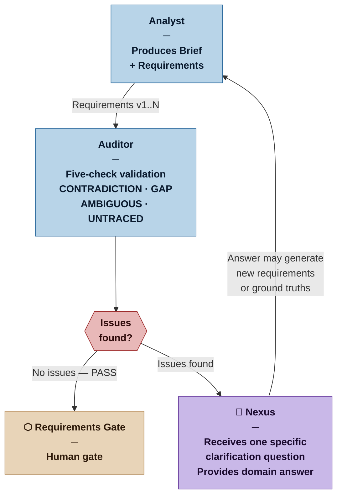
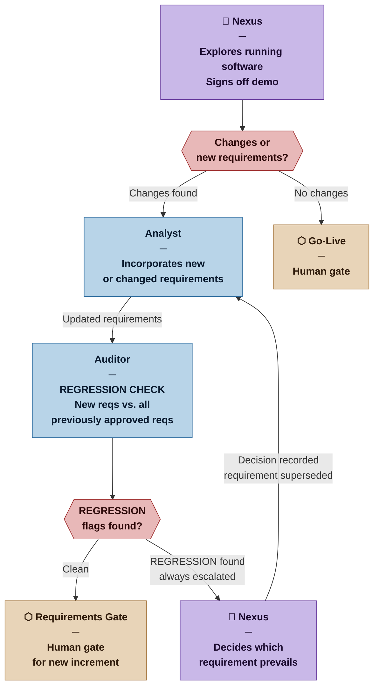

<!--
Copyright 2026 Pablo Ochendrowitsch

Licensed under the Apache License, Version 2.0 (the "License");
you may not use this file except in compliance with the License.
You may obtain a copy of the License at

    http://www.apache.org/licenses/LICENSE-2.0

Unless required by applicable law or agreed to in writing, software
distributed under the License is distributed on an "AS IS" BASIS,
WITHOUT WARRANTIES OR CONDITIONS OF ANY KIND, either express or implied.
See the License for the specific language governing permissions and
limitations under the License.
-->

# DEC-0015: Ingestion Loop Design

**Status:** Accepted
**Date:** 2026-03-12
**Deciders:** Nexus (Human), Nexus Method Architect

## Context

Ingestion is not a linear one-shot phase. Requirements are rarely complete or contradiction-free on first pass, and they evolve throughout the project as the Nexus gains understanding through working software. Two feedback mechanisms drive this evolution: the Auditor clarification loop (within ingestion) and the demo discovery loop (post-execution).

## Decision

### The Ingestion Loop

Ingestion consists of three roles operating in a multi-pass cycle:

1. **Analyst** — elicits, understands, and formalizes requirements
2. **Auditor** — validates requirements for consistency, completeness, coherence, traceability, and testability
3. **Nexus** — resolves issues that only domain knowledge can answer

Every issue found by the Auditor triggers a clarification question to the Nexus — not a bounce back to the Analyst alone. The Analyst cannot resolve domain contradictions. Only the Nexus can.

Each clarification cycle is a full new pass: Analyst incorporates the answer, Auditor re-checks everything. The loop continues until the Auditor finds no issues.

### The Demo Discovery Loop

Each execution cycle ends with a demo — a runnable version of the software the Nexus can explore. At Demo Sign-off, the Nexus may include new requirements or changes of mind.

When this happens, ingestion re-opens:

This is expected behavior, not process failure. The demo is a discovery mechanism. The system is designed for it.

### Auditor Flag Types

| Flag | Meaning |
|---|---|
| `[CONTRADICTION]` | Two requirements conflict with each other. Both cited. |
| `[GAP]` | Something in the Brief has no corresponding requirement. |
| `[AMBIGUOUS]` | Requirement too vague to test or act on. |
| `[UNTRACED]` | Requirement with no clear origin in the Brief or a Nexus answer. |
| `[REGRESSION]` | New or changed requirement conflicts with a previously approved one. Nexus must decide which takes precedence. |
| `[PASSED]` | Requirement cleared all checks. |

`[REGRESSION]` flags are always escalated to the Nexus — never resolved silently between agents. Overriding a previously approved requirement is a conscious human decision.

### Auditor Constraints

- The Auditor **does not modify requirements**. It produces an audit report with flags.
- The Analyst makes all changes in response to Auditor flags and Nexus answers.
- Clarification questions to the Nexus must be **specific and actionable** — never "we found a problem," always "requirement REQ-004 states X but REQ-011 states Y — which takes precedence?"

## Rationale

**Why the Auditor asks the Nexus directly:** Some contradictions cannot be resolved without domain knowledge the Analyst does not have. Bouncing only to the Analyst creates a false loop where the same issue resurfaces at the Requirements Gate. Direct Auditor → Nexus questions keep the loop honest.

**Why demos trigger ingestion re-entry:** The Nexus cannot always articulate requirements they do not yet know they have. Working software is the most effective requirements elicitation tool. Treating demo feedback as a natural re-entry point — not an exceptional case — makes the process robust to the reality of how requirements evolve.

**Why regression checks are mandatory:** A new requirement approved in isolation may silently invalidate work approved in a prior cycle. The Auditor is the only agent with visibility across the full requirements history. Regression checking is its unique contribution at this stage.

## Consequences

- Ingestion is a recurring activity throughout the project, not a one-time upfront phase
- The Analyst and Auditor must always have access to the full requirements history, not just the current cycle's additions
- `[REGRESSION]` flags may slow delivery when late-cycle requirement changes arrive — this is a feature, not a bug: the cost is made visible rather than hidden
- The Methodologist may detect patterns in clarification frequency and recommend more thorough elicitation upfront (profile or process adjustment)

## Alternatives Considered

**Auditor escalates only to Analyst, never to Nexus:** Simpler flow but domain contradictions stall indefinitely or get resolved incorrectly. Rejected for correctness.

**No regression check on demo feedback:** Faster, but risks silent requirement conflicts accumulating across cycles until they become expensive. Rejected for long-term correctness.

**Demo feedback goes through a separate Change Request process:** More formal, but introduces process weight that a Casual or Commercial project does not need. The Methodologist can add formality via profile — this decision keeps the base behavior lightweight. Rejected for premature formality.
